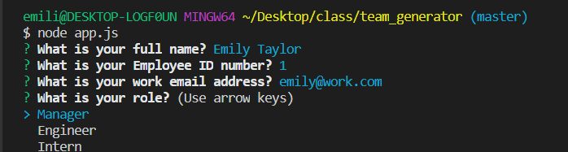
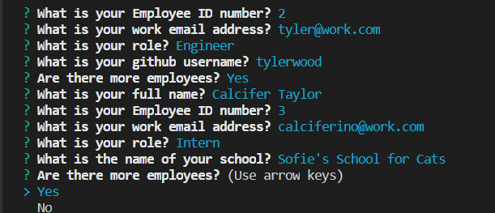
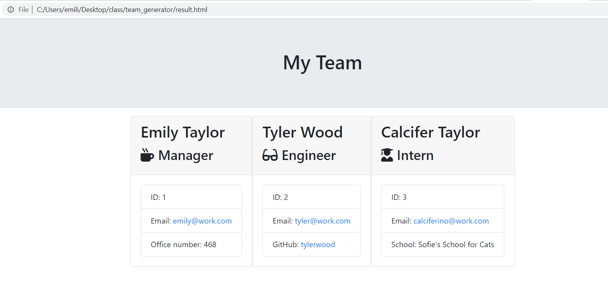

# team_generator
(https://github.com/emilyporterfieldtaylor/team_generator)

## Description  
This project most focused on Jest OOP testing and using pre written code to make a team generator app. This ap generates team members based on command line prompts. 
 

## Instructions
1. When you're ready, run node app.js to start the CLI.

2. You have the ability to submit as many employees as your little heart desires.

3. When you have submit all of your employees, view the result.html in the browser to see you list of employees!

    
## Table of Contents

  *[Installation](#installation)
  *[Usage](#usage)
  *[License](#license)
  *[Contribution](#contribution)
  *[Tests](#tests)
  *[Questions](#questions)
    
## Installation
To install necessary dependencies, run the following command:

--
npm i
--
    
## Usage
A lot of this repo came from the UT bootcamp github.
    
## License
Creative Commons

    
## Contributing
Make sure you are using the result.html page to view the completed page in the browser.
    
## Tests
node test
    
## Questions

​
If you have any questions about the repo, open an issue or contact https://github.com/emilyporterfieldtaylor